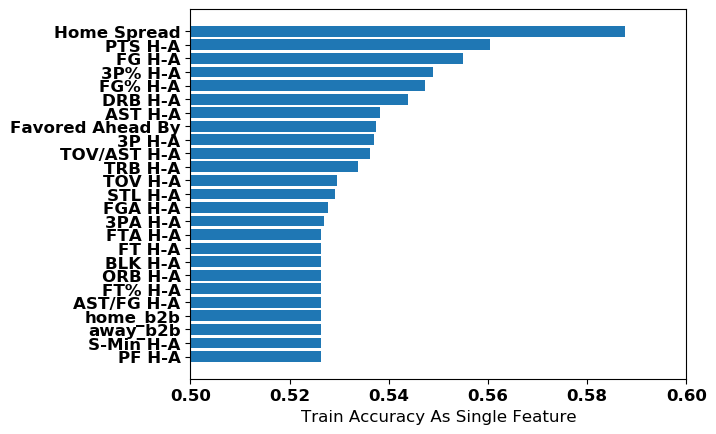
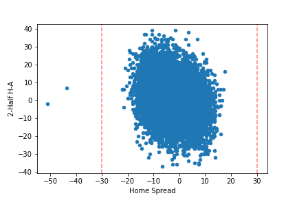
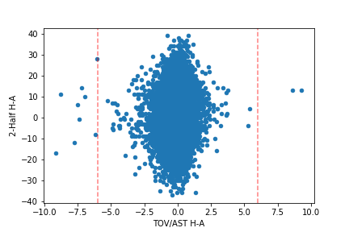
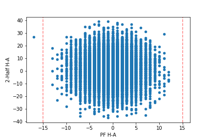
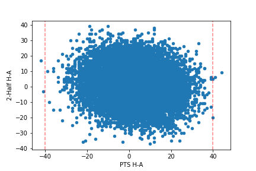
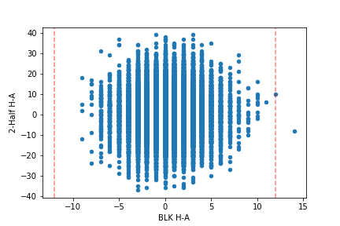
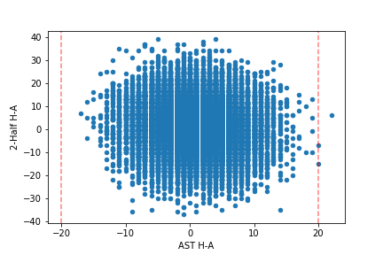
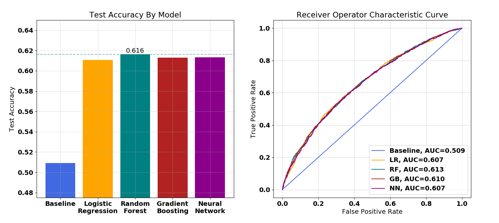

# 
NBA 2nd-Half Predictions

#### 
by Alex Diaz-Clark

Developing a supervised machine learning algorithm to predict which team will score more points in the second-half of NBA games, including a cost-benefit analysis, and betting simulation.

## Background

Sports betting was once a hobby for sports enthusiasts looking to make the games a little more exciting. But with the emergence of machine learning algorithms, predictive models are being built with the aim of predicting the results of sporting events in order to generate a small expected-profit for every bet. There are professional sports bettors all over the world that try to exploit small statistical advantages over a large volume of bets in order to turn a profit.

The goals of this project are as follows:
* Develop a machine learning model used to predict which team will score more points in the second-half of National Basketball Association (NBA) games. 
* Use the model to predict the second-half result of games during the 2015, 2016, and 2017 NBA seasons. 
* Use those predictions, along with the historical betting odds for the second-half money-line bet, in a cost/benefit analysis to develop a betting strategy for using the model. 
* Test the betting strategy on the 2018 and 2019 NBA seasons in a betting simulation.

## The Data

Data for this project was collected from multiple sources:
* In-game statistics for the first-half of 2001-2020 NBA games are from www.basketball-reference.com
* Betting Odds for the second-half money-line bet of 2015-2020 NBA games are from www.sportsbookreview.com
* Pre-game point spreads for 2007-2020 NBA games also from www.sportsbookreview.com

A script was written to scrape the first-half statistics and the 2nd-half betting odds from their respective web pages, which can be found at '/src/GetData.py' in this repository. The pre-game point spreads were directly downloaded for the website in spreadsheet files. 

The first-half statistics for each team used as model features include: minutes played by starters, field goals made, field goal attempts, 3-point shots made, 3-point shots attempted, free throws made, free throw attempts, offensive rebounds, defensive rebounds, total rebounds, assists, steals, blocks, turnovers, personal fouls, and points scored.

A few extra features were created from the first-half statistics: field goal percentage, 3-point percentage, free throw percentage,  assists per field goal, and turnovers per assist.

For the fist half statistics, a linear combination of each statistic was created as a differential between the two teams. (home - away). For example, a value of -10 for 'TRB H-A' means the away team had 10 more total rebounds in the first half than the home team. This helped reduce the feature space while still preserving any signal from each statistic.

In addition to the 21 features from first-half data, a 4 more features were created for the models: whether or not the away team playing for the second night in a row, whether or not the home team playing for the second night in a row, what was the pre-game point spread, and by how many points the pre-game favorite is leading at halftime.

The pre-game point spread is in terms of the home team. For example, a value of -4 for 'Home Spread' means that the sports-books believe the home team to be most likely to win the game, by a margin of 4 points. This feature contains a lot of information as it tells the model which team the general public believes to be the best team.

The 'Favored Ahead By' feature is in terms of the pre-game favorite. For example, a value of +8 for 'Favored Ahead By' means that the team which was favored to win before the game started, is ahead by 8 points at halftime.

As you can see, a shorthand was used for each feature name in this project, but you can find the metadata file which has descriptions of each feature at '/data/data_metadata.csv' in this repository, 

The data required extensive cleaning and processing to get tot this point. The script which executes all of the cleaning can be found at '/src/JoinAndClean.py' in this repository.

Although first-half statistics for over 25,000 NBA games were collected, the pre-game point spread was only found for approximately the last 16,500 games. The decision was made to only use the games with the pre-game point spread because if the features importance. When used as a single feature to predict which team scores more points in the second half, the pre-game point spread was the most powerful predictor, as shown below:

Removing outliers only reduced the number of samples from 16,476 to 16,461. Outliers were removed from the data for the following features at the respective thresholds shown in the plot below:

At this point, the data is almost ready for modeling. The final step is to define the target variable. The target variable for the model is whether or not the home team score more points after halftime than the away team (1 = yes, 0 = no). The variable is categorical and created by asking is '2-Half H-A' > 0. The target variable is 1 about 53% of the time, so there is no need for class rebalancing. 

## Tuning Models

Tuning different machine learning models is a time-consuming processs and much effort is put into gaining incremental improvements in algorithm performance. With repect to this project, the following models were tuned: Logistic Regression, Random Forest Classifier, Gradient Boosting Classifier, and a forward-feeding Neural Network with one hidden layer. 

For model-tuning, a train-test split was used. 25% of the data was set aside for later testing and choosing between the optimized version of each model. The remaining 75% of the data was used in Grid Search with 10-fold cross-validation to tune each model. 

For this project, I want to make as many bets as possible to spread my risk over as many trials as possible, so am concerned with every prediction and not only those samples predicted to be in the positive class. Thus, I decided to score the models on accuracy as opposed to any other metric. 

## Model Selection

The baseline model was simply a random sample of 1 or 0 with an equal chance of either case for each prediction. If we can't beat flipping a coin, there's no point in going any further. As explained at the end of the data section, predicting a 1 for every sample will be correct about 53% of the time, so the models should be better than 53% if they are doing anything right. 

After tuning the hyperparameters for each model, the best performing on predicting the cross-validated train data for each model was compared to eachother using accuracy when predicting the unseen test data, and the area under the Receiver Operator Characteristic (ROC) curve. The results are shown in the figure below:

As you can see, the baseline model had a test accuracy of about 51%. Unsuprisingly, all tuned models performed significantly better than the baseline and the Random Forest Classifier performed the best, with a test accuracy of 61.6% and an area under the ROC curve of 0.613. 

## Cost/Benefit Analysis

## Betting Simulation

The bet that this model was built to exploit for a profit is the second-half moneyline bet. With this bet, a bettor can place a wager on either team to score more points than their opponent in the second-half, including overtime, with the actual winner of the game having no impact on the result of the bet. It is pretty stright-forward, if you pick team A, and team A scores more points after halftime, you win the bet. If team B scores more points after halftime, you lose the bet. If the teams score the same amount of points after halftime, the full bet is returned to the bettor.

While deciding who wins the bet is pretty straight forward, the betting odds are not. The odds are listed in the following format:

* "-150" means that to win $100 profit, the bettor must wager $150.
* "+150" means that if the bettor wagers $100 to win $150 profit.

Odds that are negative, are typically reserved for the team that the sportbook favors to score more points after halftime. Odds that are positive, indicate that the sportsbook believes that team will score less points than their opponent after halftime. This can be confusing, so for the sake of the reader, and to make calculations more stright-forward in the simulation, the odds have all been converted to a format which is strictly the potential profit from a $100 bet. For example:

* "-150" is converted to "$66.67"
* "+150" is converted to "$150.00"

## Conclusions

## Next Steps

## Disclaimer
Sports betting, or gambling of any sort, should not be taken lightly. The models and strategies recommended here are simply for educational purposes. USE AT YOUR OWN RISK. If you, or someone you know, might have a gambling problem, please call the National Problem Gambling Helpline at 1-800-522-4700
