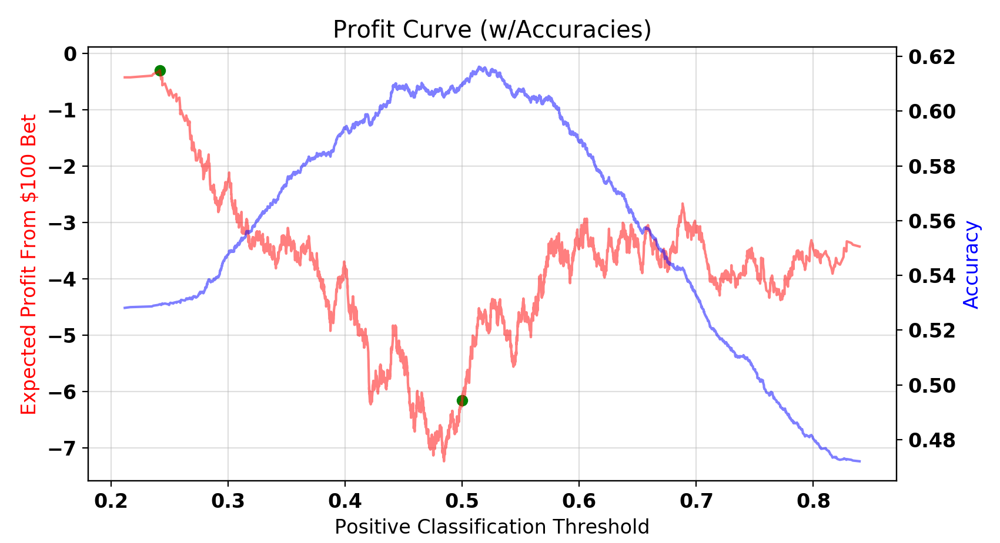

# 
NBA 2nd-Half Predictions

#### 
by Alex Diaz-Clark

Developing a supervised machine learning algorithm to predict which team will score more points in the second-half of NBA games, including a cost-benefit analysis, and betting simulation.

## Background

Sports betting was once a hobby for sports enthusiasts looking to make the games a little more exciting. But with the emergence of machine learning algorithms, predictive models are being built with the aim of predicting the results of sporting events in order to generate a small expected-profit for every bet. There are professional sports bettors all over the world that try to exploit small statistical advantages over a large volume of bets in order to turn a profit.

The goals of this project are as follows:
* Develop a machine learning model used to predict which team will score more points in the second-half of National Basketball Association (NBA) games. 
* Use the model to predict the second-half result of games during the 2015, 2016, and 2017 NBA seasons. 
* Use those predictions, along with the historical betting odds for the second-half money-line bet, in a cost/benefit analysis to develop a betting strategy for using the model. 
* Test the betting strategy on the 2018 and 2019 NBA seasons in a betting simulation.

## The Data

Data for this project was collected from multiple sources:
* In-game statistics for the first-half of 2001-2020 NBA games are from www.basketball-reference.com
* Betting Odds for the second-half money-line bet of 2015-2020 NBA games are from www.sportsbookreview.com
* Pre-game point spreads for 2007-2020 NBA games also from www.sportsbookreview.com

A script was written to scrape the first-half statistics and the 2nd-half betting odds from their respective web pages, which can be found at '/src/GetData.py' in this repository. The pre-game point spreads were directly downloaded from the website in spreadsheet files. 

The first-half statistics used as model features include: minutes played by starters, field goals made, field goal attempts, 3-point shots made, 3-point shots attempted, free throws made, free throw attempts, offensive rebounds, defensive rebounds, total rebounds, assists, steals, blocks, turnovers, personal fouls, and points scored.

A few extra features were created from the first-half statistics: field goal percentage, 3-point percentage, free throw percentage,  assists per field goal, and turnovers per assist.

For the first-half statistics, a linear combination of each statistic was created as a differential between the two teams (home - away). For example, a value of -10 for 'TRB H-A' means the away team had 10 more total rebounds in the first half than the home team. This helped reduce the feature space while still preserving any signal from each statistic.

In addition to the 21 features from first-half data, 4 more features were created for the models: whether or not the away team is playing for the second night in a row, whether or not the home team is playing for the second night in a row, what was the pre-game point spread, and by how many points the pre-game favorite is leading at halftime.

The pre-game point spread is in terms of the home team. For example, a value of -4 for 'Home Spread' means that the sports-books believe the home team is most likely to win the game, by a margin of 4 points. This feature contains a lot of information as it tells the model which team the general public believes to be the best team.

The 'Favored Ahead By' feature is in terms of the pre-game favorite. For example, a value of +8 for 'Favored Ahead By' means that the team which was favored to win before the game started, is ahead by 8 points at halftime.

As you can see, a shorthand was used for each feature name in this project, but you can find the metadata file which has descriptions of each feature at '/data/data_metadata.csv' in this repository, 

Although first-half statistics for over 25,000 NBA games were collected, the pre-game point spread was only found for approximately the last 16,500 games. When used as a single feature in an un-tuned logistic regression to predict which team scores more points in the second half, the pre-game point spread was the most powerful predictor, as shown below. Hence, the decision was made to only use the games with the pre-game point spread because if the feature's importance.

Removing outliers only reduced the number of samples from 16,476 to 16,461. Outliers were removed from the data for the following features at the respective thresholds shown in the plots below:

At this point, the data is almost ready for modeling. The final step is to define the target variable. The target variable for the model is whether or not the home team scored more points after halftime than the away team (1 = yes, 0 = no). The variable is categorical and created by asking is '2-Half H-A' > 0. The target variable is 1 about 53% of the time, so there is no need for class rebalancing. 

The data required extensive cleaning and processing to get to this point. The script which executes all of the cleaning can be found at '/src/JoinAndClean.py' in this repository.

## Tuning Models

Tuning different machine learning models is a time-consuming process and much effort is put into gaining incremental improvements in algorithm performance. With respect to this project, the following models were tuned: Logistic Regression, Random Forest Classifier, Gradient Boosting Classifier, and a forward-feeding Neural Network with one hidden layer. 

For model-tuning, a train-test split was used. 25% of the data was set aside for later testing and choosing between the optimized version of each model. The remaining 75% of the data was used in Grid Search with 10-fold cross-validation to tune each model. 

For this project, I want to make as many bets as possible to spread my risk over as many trials as possible, so am concerned with every prediction and not only those samples predicted to be in the positive class. Thus, I decided to score the models on accuracy as opposed to any other metric. 

## Model Selection

The baseline model was simply a random sample of 1 or 0 for each prediction, with an equal chance of either case. If we can't beat flipping a coin, there's no point in going any further. 

As explained at the end of the data section, predicting a 1 for every sample will be correct about 53% of the time, so the models should also be better than 53% if they are doing anything right. 

After tuning the hyper-parameters for each model, the version with the highest prediciton accuracy on the train data was selected. Next each type of model's best performer was compared using accuracy when predicting the unseen test data, and the area under the Receiver Operator Characteristic (ROC) curve. The results are shown in the figure below:

As you can see, the baseline model had a test accuracy of about 51%. Unsurprisingly, all tuned models performed significantly better than the baseline and the Random Forest Classifier performed the best, with a test accuracy of 61.6% and an area under the ROC curve of 0.613. So, going forward, I will be using the Random Forest Classifier for all predictions. 

The script which performs the model tuning and generates visualizations for the model comparison can be found at '/src/ModelSelection.py' in this repository.

## Cost/Benefit Analysis

Armed with my machine learning algorithm and historical betting odds for the last five seasons, I turn my attention to conducting a cost/benefit analysis with the goal of developing a betting strategy. The 2015, 2016, and 2017 seasons will be used to conduct the analysis and develop an optimum betting strategy, while the 2018 and 2019 seasons (up until the season was halted due to the COVID-19 pandemic) will be reserved for the betting simulation. It is important that the betting simulation is conducted on games which had no influence on the development of the betting strategy. That way we know if the betting strategy is generalizable, along with the model.

The bet that this model was built to exploit for a profit is the second-half money-line bet. With this bet, a bettor can place a wager on either team to score more points than their opponent in the second-half, including overtime, with the actual winner of the game having no impact on the result of the bet. It is pretty straight-forward, if you pick team A, and team A scores more points after halftime, you win the bet. If team B scores more points after halftime, you lose the bet. If the teams score the same amount of points after halftime, the full bet is returned to the bettor.

While deciding who wins the bet is pretty straight forward, the betting odds are not. The odds are listed in the following format:

* "-150" means that to win $100 profit, the bettor must wager $150.
* "+150" means that the bettor must wager $100 to win $150 profit.

Odds that are negative, are typically reserved for the team that the sports-book favors to score more points after halftime. Odds that are positive, indicate that the sportsbook believes that team will score less points than their opponent after halftime. This can be confusing, so for the sake of the reader, and to make calculations more straight-forward in the simulation, the odds have all been converted to a format which is strictly the potential profit from a $100 bet. For example:

* "-150" is converted to "$66.67"
* "+150" is converted to "$150.00"

For the cost/benefit analysis, I predicted each seasons' games by training the model on the data from every other season, then predicting the season in question. I placed a mock wager of $100 on the second-half money-line bet. I bet on the home team if the model predicted the target variable to be 1 (positive class), and bet on the away team if the model predicted a 0 (negative class). As a reminder, the target variable answers the question: Will the home team score more points in the second-half than the visiting team? I used the prediction, the results of the game, and the actual halftime betting odds for each game to generate the profit curve shown below. 

The profit curve shows the expected profit for each $100 bet as a function of the positive classification threshold. The prediction model doesn't just return a 1 or a 0. It returns a probability that the target variable is a 1. By default, the probability is just rounded to 1 or 0 to determine the prediction. So any prediction probability above 0.5 will become a prediction of 1. The purpose of the profit curve is so you can adjust the positive classification threshold to be lower or higher than 0.5 and see how that effects your expected profit.

You can see that although losing money, the expected profit for each bet is maximized when the classification threshold is so low that you're essentially classifying everything as 1, and betting on the home team every game, even though the predictions are much more accurate when the classification threshold is closer to 0.5. The reason is clear when looking at the cost/benefit matrices for these situations.

The cost/benefit matrix lets you see the expected financial impact of the true-positive, false-positive, true-negative, and false-negative predictions. In this case, the cost/benefit matrix changes along with the positive classification threshold because as you change the threshold, the games that make up the four cost/benefit matrix categories change, and in turn so do the average payouts from their respective bets. Shown below are the cost/benefit matrices assuming a $100 bet on each prediction for the classification thresholds of 0.5 and 0:

Threshold: 0.5 | Predict Positive | Predict Negative
--- | :---: | :---:
**Positive** | $44.76 | -$100
**Negative** | -$90.69 | $58.30 

                                   
Threshold: 0 | Predict Positive | Predict Negative
--- | :---: | :---:
**Positive** | $81.79 | N/A
**Negative** | -$92.43 | N/A

                                       
You can see that with the positive classification threshold set to 0.5, on average I am losing more money on the bad bets than I am winning on the good ones. With the threshold set to 0 (predicting 1 every time, hence betting on the home team every time), that difference is much smaller. However, there is still a deficit and the betting strategy is still not profitable. 

The above profit curve is created when I am betting on every game. I can choose to only place a bet when the potential payout is above a certain threshold. Shown below, adding another dimension to the profit curve to represent the betting payout threshold, transforms it into a profit surface:

The forward edge of the profit surface is simply the profit curve we were previously examining, where the payout threshold is 0 and I'm willing to accept any bet. You can see that as I become more selective about which bets I'm willing to accept (increasing the payout threshold), the system becomes more profitable.

The maximum for this profit surface is at a classification threshold of 0.45 and a payout threshold of $186. The expected profit from each bet at these thresholds is an eye-popping $193. However, at a payout threshold of $186, I am being way too selective and these betting opportunities are far and few between. At these thresholds, I am only placing 5 bets over the entire 3 seasons. This is not ideal. As with any system where you're trying to exploit a small statistical advantage for a profit, you want to spread your risk over as many trails as possible. We can transform the profit surface to display the total profit over the 3 seasons, as opposed to the expected profit per bet. This will take into account the number of bets placed for each set of thresholds and we can choose a more appropriate betting system. The total profit surface is shown below:

The global maximum of the total profit surface is at a classification threshold of 0.2425 and a payout threshold of $104, with an expected profit per bet of $9.84 for 1,343 bets in these 3 seasons. This result is telling me that the most profitable system I can use is to forget the model and simply bet on the home team every time the payout is above $104. That's disappointing because I wont be using my algorithm to predict results. So, I will run the betting simulation on a betting system that uses the global maximum's thresholds, but I will also find a local maximum with a classification threshold above 0.35 and run the betting simulation on that system. That way, I can see the algorithm's predictions in action and see if they are profitable in the simulation. 

The local maximum I will use is at a classification threshold of 0.605 and a payout threshold of $87. This system has an expected profit of $3.62 per bet for 1,244 bets in these 3 seasons. 

The script which executes the cost/benefit analysis can be found at '/src/CostBenefit.py' in this repository.

## Betting Simulation

I want to simulate betting in the most realistic way possible, so when making predictions for the 2018 and 2019 seasons, the machine learning model was trained on data from games only in the seasons previous to the season I am predicting. That way, my model has no future knowledge of NBA results at the time it's making predictions. It's as if my model was making the predictions on the day of the game. 

Predicting the result for each game, and placing a $100 bet on each prediction (1 = bet home team, 0 = bet away team), I plotted the cumulative profit after each bet placed for both betting strategies below:

The "bet the home team every time" strategy is in blue, while the system utilizing the model's predictions is in red. The vertical dotted lines represent the end of the 2018 season. You can see that the "bet the home team every time" system had a great profit the first season, but actually lost money on the second season. While the system using the model's predictions profited about $1500 each of the two seasons. Below is a table summarizing the results:

Classification and Payout Thresholds | Sim. Profit | Sim. Profit per Bet | Estimated Profit per Bet from Cost/Benefit Analysis
--- | :---: | :---: | :---:
(0.242, $104) | $2,858.00 | $3.57 | $9.84
(0.605, $87) | $3,002.12 | $3.74 | $3.62

So the "bet the home team every time" strategy was not as strong in these 2 seasons as it was in the previous 3 seasons. The system utilizing the model's predictions delivered as expected, and slightly outperformed the other model.

The script which executes the betting simulation can be found at '/src/BettingSim.py' in this repository.

## Conclusions

My big takeaways from this project are as follows:
* Past results don't always dictate future results. Although both systems were profitable over the simulated seasons, the system which performed overwhelmingly better in the 3 seasons used to conduct the cost/benefit analysis did not perform better in the simulation.
* There are applications where a model predicting with only 61% accuracy can be exploited for a profit. 
* Finally, the cost/benefit of your predictions is often more important than the accuracy of your predictions. 

## Next Steps

There are a few ideas I would like to explore to improve this project:
* Weigh my bets in accordance with the prediction probabilities from my algorithm such that I am betting more money on the predictions which my model is more certain of. 
* Continue tuning the Neural Network and try to develop a better predicting model.
* Attempt to use other types of machine learning models, such as XGBoost. 
* Adjust my betting amount as my cumulative profit grows to see if compounding the winnings during the simulation has a significant effect on the outcome.

## Acknowledgments

I would like to thank www.basketball-reference.com and www.sportsbookreview.com for making this data publicly available and accessible. I would also like to thank the instructors and staff of Galvanize -- San Francisco's Data Science Immersive Program for their guidance in developing this project. 

## Disclaimer
Sports betting, or gambling of any sort, should not be taken lightly. The models and strategies recommended here are simply for educational purposes. USE AT YOUR OWN RISK. If you, or someone you know, might have a gambling problem, please call the National Problem Gambling Helpline at 1-800-522-4700
